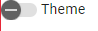

# NG-DynForms-ThemeSwitch
Testing dynamic forms and angular material theme switcher, angular 17

## Form generator

## Theme switch component

Theme switch
based on https://github.com/monacodelisa/Angular-Theming-Signals
