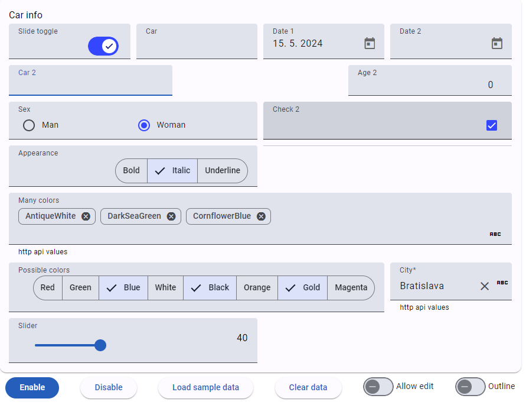

# DynForm
Testing angular material dynamic forms, angular 17

## Form generator
* Json file definition
* Editing mode - node.js service (dyn-form-service) for storing json file into file system
* Responsive
* Support form validators and hints
* Support for text, textarea, divider, space, select, number, checkbox, date, radio group
* Support for autocomplete and chips with autocomplete with http get api source
* Support for widths full, half, thirds, quarters, max 1 up to 4 columns with automatic wrap
* Support for moving controls in editing mode

## Presentation mode

## Editing mode

Related with [dyn-form-server](https://github.com/b-mi/dyn-form-server)

## Material typography cheat list (not working now)
