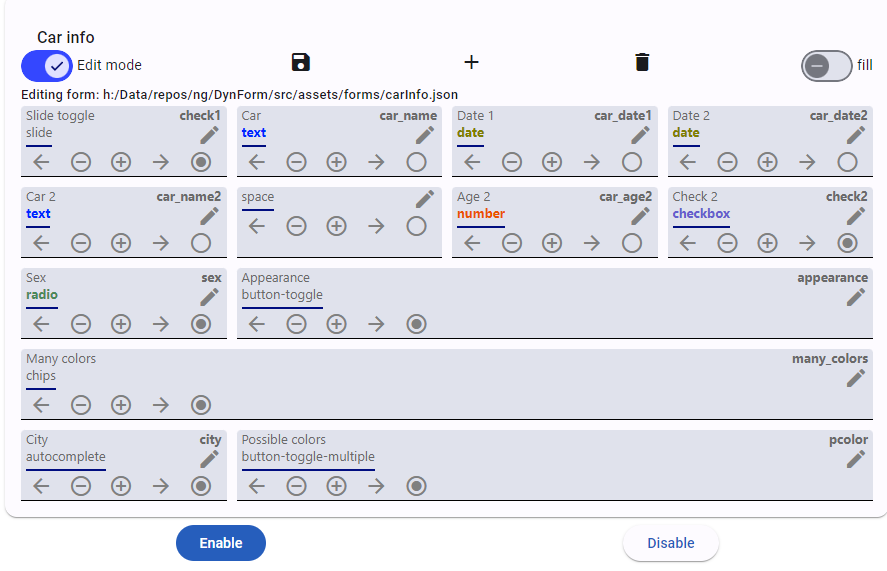

# ng-dyn-forms
Testing angular material dynamic forms, angular 17


## Form generator
* Json file definition
* Editing mode - node.js service (dyn-form-service) for storing json file into file system
* Responsive
* Support form validators and hints
* Support for text, textarea, divider, space, select, number, checkbox, date, radio group
* Support for autocomplete and chips with autocomplete with http get api source
* Support for widths full, half, thirds, quarters, max 1 up to 4 columns with automatic wrap
* Support for moving controls in editing mode


## Presentation mode


## Editing mode


## Sample usage


## FormGroup result

```
{
  "company": "",
  "firstName": "",
  "lastName": "",
  "address": "",
  "state": {
    "key": 3,
    "label": "Arizona"
  },
  "color": {
    "key": 3,
    "label": "Aqua"
  },
  "postal_code": null,
  "shipping": null,
  "state_list": null,
  "check1": true,
  "car_name": "",
  "car_date1": "2024-05-14T22:00:00.000Z",
  "car_date2": null,
  "car_name2": "",
  "car_age2": 0,
  "sex": "W",
  "check2": true,
  "appearance": "I",
  "many_colors": [
    {
      "key": 2,
      "label": "AntiqueWhite"
    },
    {
      "key": 34,
      "label": "DarkSeaGreen"
    },
    {
      "key": 18,
      "label": "CornflowerBlue"
    }
  ],
  "pcolor": [
    "BL",
    "G",
    "B"
  ],
  "city": {
    "key": 100,
    "label": "Bratislava"
  },
  "slider": 40
}
```

Related with [ng-dyn-form-server](https://github.com/b-mi/ng-dyn-form-server)
